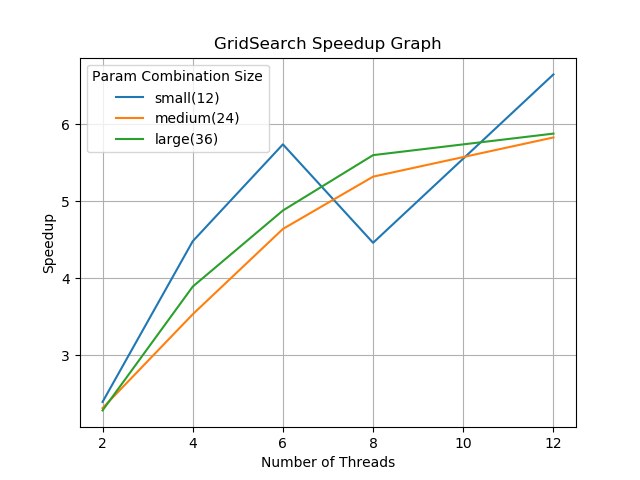

# Parallel Hyperparameter Grid Search

### Summary

My goal with this project was to implement a parallel system to perform the grid search algorithm for hyperparameter tuning on a specific machine learning model. [Grid search](https://en.wikipedia.org/wiki/Hyperparameter_optimization#Grid_search) is an “embarrassingly parallel” algorithm in which an exhaustive search is performed to find the optimal parameter values for a model. In essence, the model is separately trained using all the different combinations of the given parameters, and the parameters which result in the best training accuracy are returned. This algorithm is embarrassingly parallel because there is no communication needed between each model training process, and thus each model training can be easily separated.
This grid search program has both sequential and parallel versions. Based on the commands given, the Go program reads in a JSON file of a set of parameter values, and then executes a separate Python script for each possible combination of parameters to train a support vector machine (SVM) classifier model. The Python script reads in a CSV file of [training data](https://en.wikipedia.org/wiki/MNIST_database), and then trains the model using its given set of parameters (with cross validation) and then returns the training accuracy to the Go program. After the training accuracies are found for all possible parameter combinations, the program finds and prints out the combination of parameters that led to the highest accuracy. 
The parallel version of the system is implemented using a queue-based work distribution scheme based on the number of threads given. The main goroutine creates a set of runnable tasks for each of the possible parameter combinations, and fills a set of queues equal to the number of threads with an (almost) equal amount of work each. For each thread given in the command line, a “worker” goroutine is created which is given its own local queue from the set of queues. The main goroutine launches each of the workers, which then begin to take tasks from their local queue and perform the model training. The system also allows the workers to perform work balancing, explained below. After a worker retrieves the training accuracy for a given set of parameters, it adds this information to an array in the SharedContext data structure. The main goroutine tells each of the workers to exit, and then prints out the out the combination of parameters that led to the highest accuracy from the SharedContext.

### Work Balancing

Work balancing is implemented as an advanced feature in this project. The work balancing algorithm is invoked in the worker Run() method in worker/worker.go, and the actual work balancing is performed as a method called Balance() on the queue in queue/queue.go. After a worker tries to dequeue and run a task, with probability of one over the size of its queue it will potentially perform a “work balance”. The worker will randomly select another worker’s queue, and if the difference between its local queue size and the other queue size is at or above a threshold (currently set to two in queue.go), the worker will take tasks from the from the larger queue and enqueue them in the smaller queue until they are both almost equal in size. This scheme is possible due to the concurrent queue implementation in queue.go, in which the Balance() method locks down both of the queues for enqueueing and dequeueing. Please note, the small queue size difference threshold was chosen since each task of training the model takes a relatively long time for each worker to perform, and so the queue balancing is almost always worth the cost.

### Notes
* Please ensure that Pandas, NumPy, and Scikit-Learn are installed in the Python environment. The program will not run without these libraries installed
* I am using a heavily downsampled (balanced) version of the mnist dataset, with 3600 entries. This is for the sake of speed, especially since we are performing cross-validation on the model. The dataset is called mnist_resampled.csv and is stored in the gridsearch/data directory
* To run:
  * `cd` into the `gridsearch` directory, and run `go run gridsearch.go paramsize kfolds [threads]`
  * Usage:
    * `paramsize` = the size of the parameter json file to perform gridsearch on. This should be 'small', 'medium', or 'large'
    * `kfolds` = the number of kfolds in the model cross validation (must be > 1). Recommend 2 or 3 for speedier performance
    * `[threads]` = the number of threads (optional, will run parallel version)
  * To run the program sequentially, simply run without the `[threads]` parameter
  * When completed, the program will print out the best parameters and associated training accuracy
